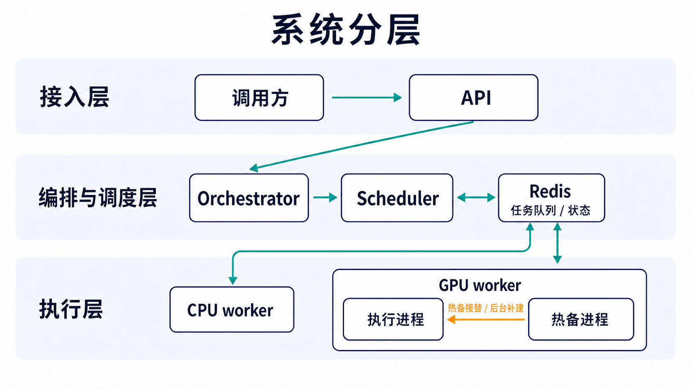
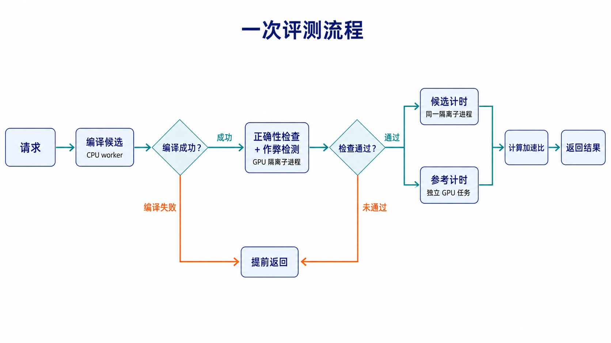

# KernelGYM 整体流程

KernelGYM 是一个 kernel 评测服务。调用方提交参考 PyTorch 实现和候选 kernel，服务完成编译、正确性检查、作弊检测和性能计时，返回候选相对参考实现的加速比。
<!-- 对调用方来说这是一次同步调用：提交请求，等待结果，内部的拆分和调度都不可见 -->

## 系统分层



服务内部有三类角色：
- orchestrator 把一次请求拆成有先后依赖的阶段任务；
- scheduler 按任务需要的资源把任务分发到集群中的节点；
- Redis 保存任务队列和状态。

节点上跑两种 worker：
- CPU worker 编译候选代码
- GPU worker 加载模型并运行 kernel，检查正确性并计时
<!-- - 。主节点跑 API 和 Redis，也可以带本地 worker，其余节点只跑 worker，从主节点领任务 -->

由于候选代码可能包含恶意代码，或破坏 GPU context，因此 GPU worker 把每个候选代码都单独隔离到子进程里执行，代码出错最多杀掉这个子进程，拖不垮 worker 本身。
每个 GPU worker 常驻两个子进程，一个执行任务，一个热备。子进程每完成一个任务就被 kill，热备立刻接下一个任务，后台再补建新的热备

## 评测阶段细节

从概念上看，一次评测就是三个阶段：

| 阶段 | 作用 |
| --- | --- |
| 正确性（correctness） | 编译候选 kernel，对比候选和参考的输出，确认候选算得对 |
| 作弊检测 | 检查候选有没有投机取巧，比如 fallback 回 Pytorch |
| 计时（timing） | 分别测量候选和参考的运行时间，算出加速比 |

正确性和作弊检测都是计时的前提：算得不对的 kernel 没有测速度的意义，作弊的 kernel 测出来也不算数，所以任何一个不通过都直接返回，计时阶段不会执行

<!-- 部署时按资源把三个阶段拆成三个任务执行：编译放在 CPU worker 上，正确性检查、作弊检测和候选计时放在 GPU worker 上，参考计时是单独的 GPU 任务。这样编译不占用 GPU，参考耗时也能脱离具体候选单独缓存和共享 -->

## 一次评测



### 1. 编译候选

<!-- scheduler 选定一个节点，由该节点的 CPU worker 完成编译，产物留在节点本地，后续 GPU 评测也在同一节点进行，产物不用跨节点搬运。 -->
候选代码通过 TVM-FFI binding 接入。`tvm_ffi.cpp.build` 组织 CUDA/C++ 源码的编译和链接，底层调用 `nvcc` 编译 `.cu`，生成 GPU 子进程可以加载的共享库。编译失败直接返回，后续阶段不再执行

### 2. 检查正确性与作弊检测

编译完成后，GPU 隔离子进程加载参考 Kernel 和候选 Kernel，多轮对比两者输出。
同时做作弊检测：检查 ATen fallback 等 reward-hacking 信号，并用 profiler 采集执行过程中每个 CUDA kernel 的实际运行时间，统计候选自有 kernel 的时间占比，占比过低说明候选主要靠调用现成库（如 ATen、cuBLAS）在跑，自己的 kernel 没干多少活，会被打上 decoy 标记。任何一个不通过都直接返回，计时阶段不再执行
<!-- 部分 CUPTI 版本存在 kernel 开始时间戳为 0、导致采集为空的问题，系统会按运行环境启用对应的兜底方案 -->

### 3. 计时并计算加速比

正确性和作弊检测通过后，同一个子进程对候选做性能计时，得到候选耗时。参考实现单独在一个 GPU 任务里运行并记录耗时，作为加速比的基线，这一步只测时间，不做正确性检查
<!-- 提交结果前严格同步 CUDA，保证输出和计时数据都已落定 -->

最终加速比为：

```text
speedup = reference_runtime / kernel_runtime
```

<!-- 候选正确且两个耗时都大于零时按上式计算，其余情况返回 `0` -->

<!-- 返回结果里除了加速比，还包含编译状态、正确性、decoy 标记、候选耗时、参考耗时和错误信息。服务自身的执行状态和候选质量是两个独立字段，调用方要同时看编译状态和正确性，只看一个会误判 -->

<!-- 加速比有没有意义，取决于两个耗时测得干不干净。计时围绕一个目标设计：只测 GPU 上的执行时间，并且让同一份代码多次测量得到稳定结果。 -->
具体做法：

- 计时工具用 CUDA event。每轮在被测函数前后各记录一个 event，等 GPU 同步完成后取两者的时间差。只统计 GPU 执行时间，host 侧的调度开销不进结果
- 正式计时前先跑 30 轮 warmup，不计入结果，让 JIT 编译、显存分配和 GPU 时钟进入稳定状态
- warmup 之后测 50 轮，逐轮记录，取平均值作为最终耗时，同时保留标准差和最大最小值，用来判断结果是否稳定
- 候选和参考在完全一致的执行设置下计时，例如禁止梯度；eval 模式等
<!-- - 部署时锁定 GPU 的 SM 时钟和功率上限，并开启 persistence mode，避免 DVFS 变频让同一份代码测出不同耗时 -->

## 运行环境

| 组件（包归属） | 用途 |
| --- | --- |
| NVIDIA GPU 与驱动（`libcuda.so`） | 运行 CUDA kernel |
| CUDA Toolkit（`nvcc`、CUDA headers、`libcupti`） | 编译 CUDA 源码、采集 CUDA kernel activity |
| CUDA Runtime（NVIDIA CUDA Runtime package、`libcudart`） | 管理 kernel、stream、显存和计时 |
| host C++ 工具链（`g++`、`ld`） | 编译和链接 binding |
| TVM-FFI（`apache-tvm-ffi`） | 构建和加载候选共享库 |
| CUDA 计算库（cuBLAS、cuDNN、cuFFT 等） | 提供常用 CUDA 计算能力 |
| Redis | 保存队列、状态和缓存索引 |

<!-- `nvcc`、CUDA Runtime 和宿主机驱动必须相互兼容，服务启动时会初始化 CUDA 并检查上述 CUDA 计算库是否齐全

正式性能评测还需要锁定 GPU SM 时钟和功率上限，并开启 persistence mode，减少变频带来的计时波动。profiler 使用 Kineto 和 CUPTI，最终加速比只使用 CUDA Event 的计时结果 -->

## 缓存

上面是无缓存时的完整流程。实际运行中有三层缓存，各自在不同位置截断流程。三层缓存的 key 范围不同，命中与否相互独立：

- 完整结果缓存：命中直接返回之前的评测结果，正确性和计时整体跳过
- 编译缓存：命中即跳过编译，直接复用编译产物，但正确性和计时仍要重跑
- 参考耗时缓存：同一问题的不同候选共享同一份参考耗时，命中即跳过参考计时

## 故障处理

<!-- 取消请求会传播到当前执行中的阶段：还在队列里的任务直接丢弃，运行中的 GPU 子进程被终止并回收；已经开始的 CPU 编译会运行到自然结束，因为编译在 CPU worker 主进程内执行，没有 GPU 子进程那样的边界可以安全 kill。好在编译时间不长，调用方取消后已先行返回，代价只是 worker 多占一会 CPU -->

超时和 CUDA 错误被隔离在子进程内，worker 回收子进程后继续接单，主进程不受影响。回收之后系统还会验证 GPU 本身是否健康：用全新的 CUDA context 做一次探测，通过就恢复正常，通不过就先停用这块 GPU，等待人工处理

进程级隔离有明确的边界。候选 kernel 如果把某块物理 GPU 本身搞挂，这块卡上的所有进程都会受影响，只能停用该卡；更极端的情况是宿主机驱动本身出问题，可能波及整机所有 GPU。要真正隔开这类设备级故障，需要虚拟机或 MIG 这样的硬件级边界，这是后续的改进方向
